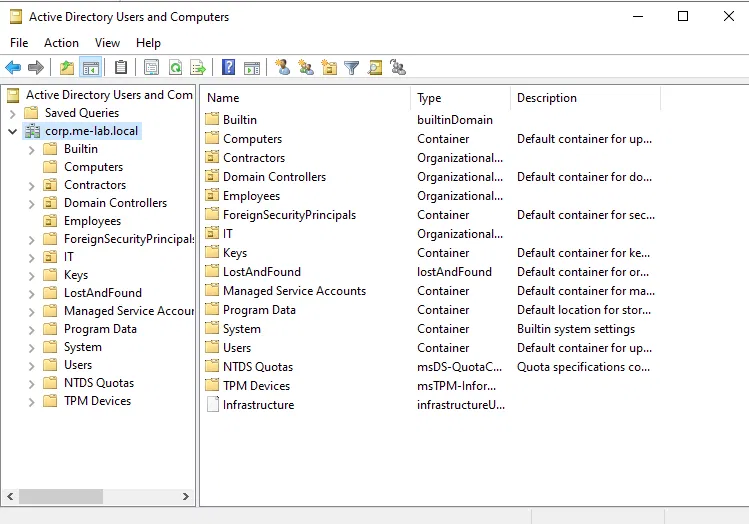
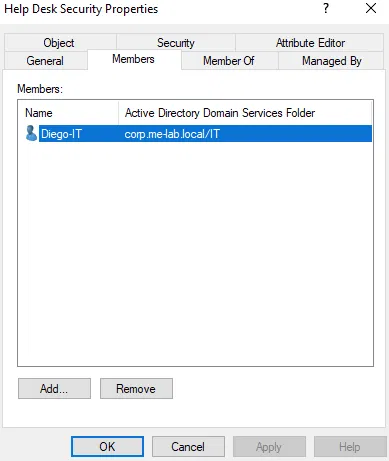
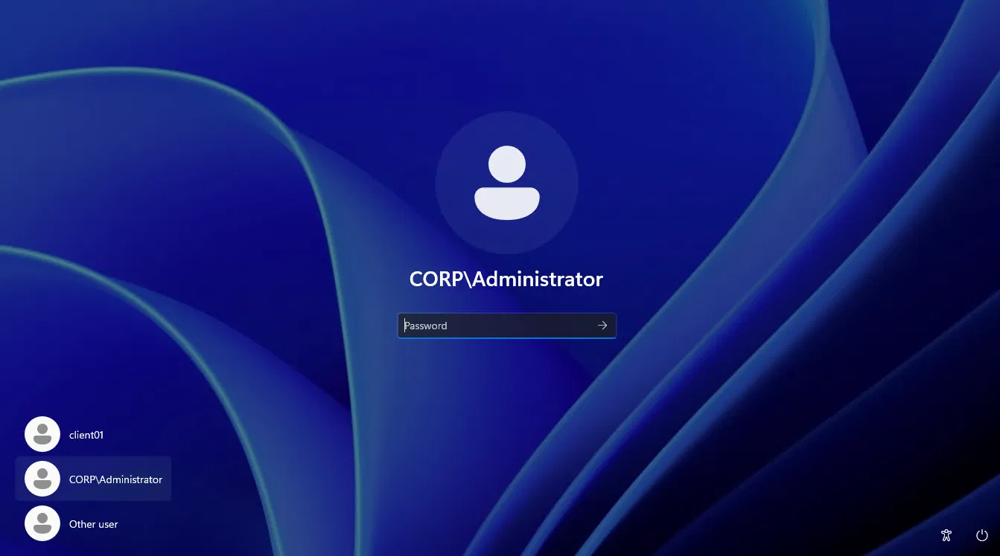
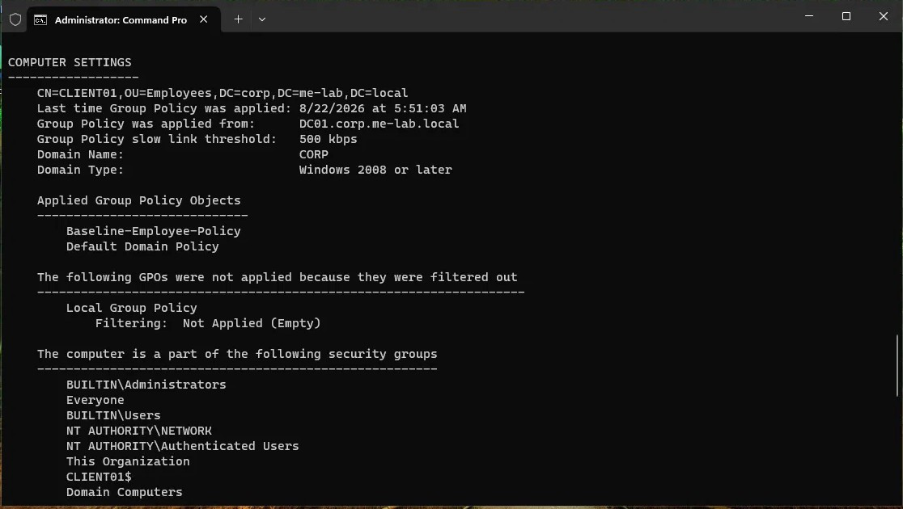

# Phase 1 — Active Directory Domain Controller & GPO Enforcement

## Goal

Stand up a working Active Directory domain to represent the identity backbone of the simulated company, join a client workstation to it, and prove that centrally-managed policy actually reaches that workstation — not just that the domain exists.

## Environment

| VM | Role | OS | Specs |
|---|---|---|---|
| DC01 | Domain Controller | Windows Server 2022 Standard (Desktop Experience) | 4 GB RAM (dynamic), 60 GB VHDX |
| CLIENT01 | Domain-joined workstation | Windows 11 Pro | 4 GB RAM (dynamic), 60 GB VHDX |

- **Hypervisor:** Hyper-V, native (Windows 11 Pro host)
- **Network:** Private virtual switch (`labnet`), fully isolated from the host network
- **Domain:** `corp.me-lab.local`
- **DC01 static IP:** 192.168.50.10 (also serves as DNS for the domain)
- **CLIENT01 static IP:** 192.168.50.20 (DNS pointed at DC01)

## What was built

### 1. Domain controller
Promoted DC01 to a new forest/domain (`corp.me-lab.local`) via the standard AD DS role installation and `dcpromo` wizard, with DNS installed alongside it.

### 2. Organizational Unit structure
Created a simple, realistic OU layout directly under the domain root:

- `Employees` — standard staff accounts and workstations
- `Contractors` — non-employee accounts
- `IT` — IT staff accounts and IT-specific security groups



### 3. Users & groups
- A personal IT admin user account (separate from the built-in `Administrator`, following the principle of not using a break-glass account for daily work)
- A `Help Desk Security` security group, scoped to the IT OU, with the IT user added as a member — laying the groundwork for delegating specific permissions instead of granting full Domain Admin rights



### 4. Client join
Built CLIENT01 as a Windows 11 Pro VM, gave it a static IP with DNS pointed at DC01, and joined it to `corp.me-lab.local` via Settings → Access work or school → Join a local Active Directory domain.



### 5. Baseline Group Policy
Created `Baseline-Employee-Policy`, linked to the `Employees` OU, enforcing a computer-level interactive logon inactivity limit (5 minutes) — the kind of basic control that maps directly to access-control requirements in frameworks like SOC 2 (CC6.1) and ISO 27001 (A.9).

## Verification

Ran `gpresult /r` on CLIENT01 after moving its computer object into the `Employees` OU (computer-level GPOs only apply to computer objects located inside the linked OU) and confirmed the policy was actually delivered:



```
COMPUTER SETTINGS
------------------
    CN=CLIENT01,OU=Employees,DC=corp,DC=me-lab,DC=local
    Last time Group Policy was applied: 8/22/2026 at 5:51:03 AM
    Group Policy was applied from:      DC01.corp.me-lab.local
    Domain Name:                        CORP
    Domain Type:                        Windows 2008 or later

    Applied Group Policy Objects
    -----------------------------
        Baseline-Employee-Policy
        Default Domain Policy
```

This confirms full end-to-end policy delivery: GPO authored on the DC → linked to the correct OU → computer object correctly placed → policy received and applied on the client.

## Lessons learned / troubleshooting notes

- **Windows 11 Pro is required for domain join** — Home edition doesn't support it.
- **Hyper-V Gen 2 VMs need TPM 2.0 manually enabled** (Settings → Security → Enable Trusted Platform Module) before Windows 11 setup will proceed; the VM must be fully powered off (not just the console window closed) before this setting becomes editable.
- **Windows 11 setup requires an internet connection by default** on a fresh install. On an isolated lab network, bypass this at the "Let's connect you to a network" screen with Shift+F10 → `oobe\bypassnro`, which restarts the setup step and unlocks an offline/local account path.
- **Computer objects default to the `Computers` container**, not whichever OU you expect — a computer-level GPO linked to an OU will silently not apply (`gpresult` shows `N/A`) until the computer object is moved into that OU.
- **The built-in `Domain Controllers` OU is reserved** for domain controller computer objects only — accidentally nesting other OUs or groups inside it (rather than at the domain root) is an easy early mistake, and moving objects back out may require disabling "Protect object from accidental deletion" first (View → Advanced Features must be on to access this).

## Next: Phase 2
 
With identity and policy enforcement working, the next phase adds a ticketing system to simulate real helpdesk request handling.

